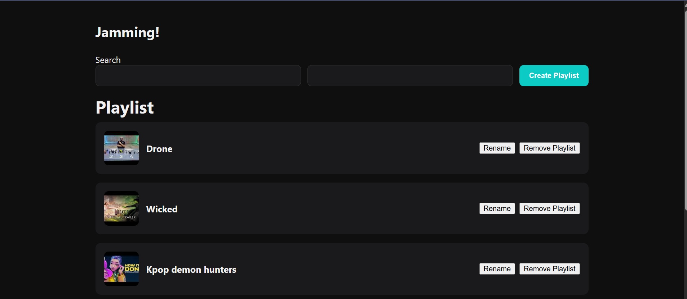
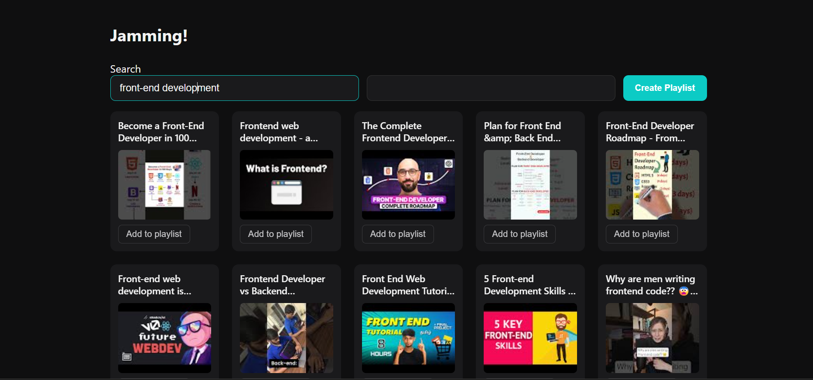
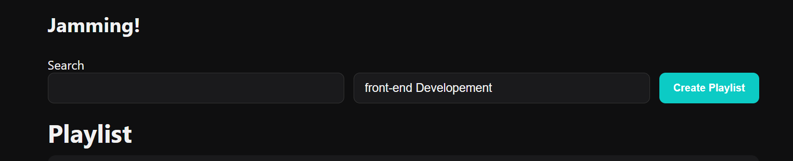
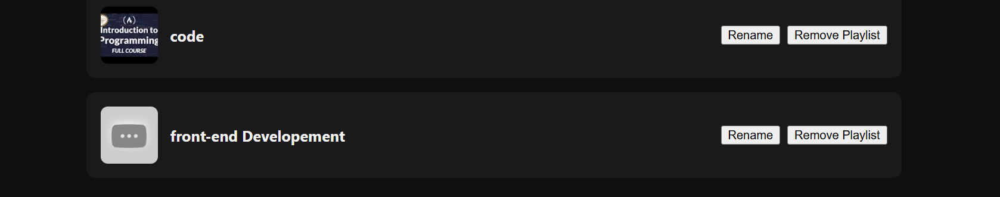
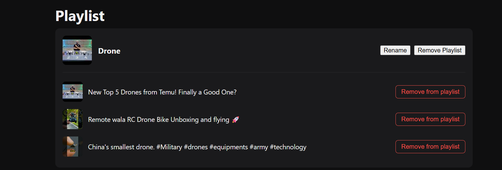
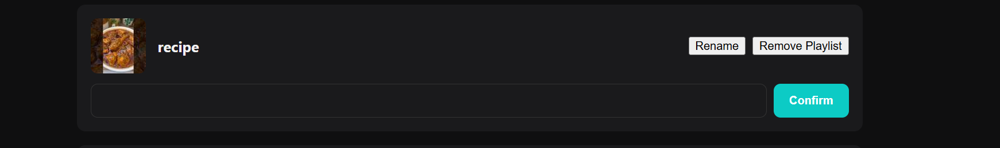

# Jamming 🎧

A playlist curation and management app built with React and the YouTube Data API v3. Search for tracks, build playlists, and manage them (rename, remove tracks, delete playlists) — all synced directly to your real YouTube account.

**Live demo:** https://jamming-indol.vercel.app
> Note: this app currently runs on an unverified Google OAuth app, so login is restricted to a small list of pre-approved test accounts (a Google requirement for apps that haven't completed formal verification). See "Known Limitations" below.

---

## Features

- 🔐 **Secure login** via Google OAuth 2.0 with PKCE (no client-side password handling)
- 🔍 **Live search** for videos/tracks via the YouTube Data API, with debounced input to avoid excessive API calls
- ➕ **Create playlists** directly on your YouTube account
- 🎵 **Add tracks** from search results into any of your playlists
- ✏️ **Rename** existing playlists
- 🗑️ **Remove tracks** from a playlist, or delete a playlist entirely
- 🔄 **Automatic token refresh** — session stays alive without needing to re-login every hour
- ⏳ Loading indicators for search and playlist creation

---

## Tech Stack

- **React** (Vite)
- **YouTube Data API v3** — search, playlists, playlistItems endpoints
- **OAuth 2.0 with PKCE** — hand-built authorization flow (no third-party auth library)
- Plain CSS for styling
- Deployed on **Vercel**

---

## Project Background

This project was originally built against the **Spotify Web API**, including a full PKCE authorization flow. Partway through development, Spotify introduced a policy requiring a Premium subscription for any app in Development Mode, which blocked further API access. The project was pivoted to the **YouTube Data API** instead — including rebuilding the OAuth flow against Google's authorization server, which has different requirements from Spotify's (notably, Google's token exchange still requires a client secret even when using PKCE, unlike Spotify's fully public-client-friendly implementation).

---

## Getting Started (Local Setup)

### Prerequisites
- Node.js (v20.19+ or v22.13+ recommended)
- A Google Cloud project with the **YouTube Data API v3** enabled
- An OAuth 2.0 **Web application** client (with `http://127.0.0.1:5173` added as an authorized redirect URI)
- A YouTube Data API **API key**

### Installation

1. Clone the repo:
   ```
   git clone https://github.com/Dasmitha-art/Jamming.git
   cd Jamming
   ```

2. Install dependencies:
   ```
   npm install
   ```

3. Create a `.env` file in the project root:
   ```
   VITE_YOUTUBE_CLIENT_ID=your_client_id_here
   VITE_YOUTUBE_CLIENT_SECRET=your_client_secret_here
   VITE_YOUTUBE_API_KEY=your_api_key_here
   ```

4. Run the dev server:
   ```
   npm run dev
   ```

5. Open `http://127.0.0.1:5173` in your browser.

---

## Known Limitations

- **Login is restricted to approved test users.** The Google OAuth app backing this project is in "Testing" mode (unverified). Google caps unverified apps to a maximum of 100 explicitly approved test accounts, and refresh tokens for test-mode apps expire after 7 days. Moving to full public availability would require completing Google's formal app verification process.
- **Client secret is exposed client-side.** As a frontend-only app with no backend server, the OAuth client secret is bundled into the JavaScript and technically visible to anyone inspecting the source. A production-grade version would proxy the token exchange through a backend server to keep this secret truly private.
- **No in-app playback.** This app manages playlists (search, add, remove, rename) but does not play audio/video directly — it's a curation tool, not a media player. Listening still happens on YouTube itself.

---

## Screenshots








